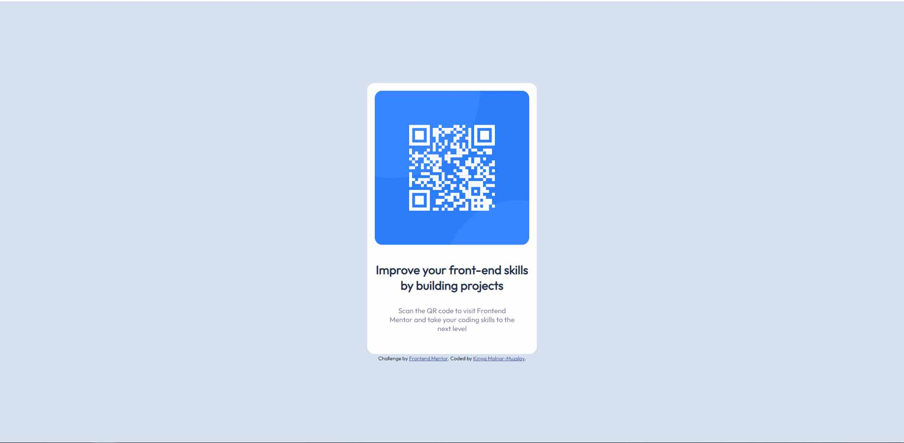

# Frontend Mentor - QR code component solution

This is a solution to the [QR code component challenge on Frontend Mentor](https://www.frontendmentor.io/challenges/qr-code-component-iux_sIO_H). Frontend Mentor challenges help you improve your coding skills by building realistic projects. 

## Table of contents

- [Overview](#overview)
  - [Screenshot](#screenshot)
- [My process](#my-process)
  - [Built with](#built-with)
  - [What I learned](#what-i-learned)
  - [Continued development](#continued-development)
  - [Useful resources](#useful-resources)
- [Author](#author)
- [Acknowledgments](#acknowledgments)

**Note: Delete this note and update the table of contents based on what sections you keep.**

## Overview

### Screenshot




## My process

### Built with

- HTML5
- CSS 


### What I learned

This is my first challenge on the Frontend Mentor site.
Doing this I needed to learn about
- GitHub
- How to write READ ME file
- How to center a div element both horizontally and vertically

To see how you can add code snippets, see below:


```css
.centering_div {
  margin: 0;
  position: absolute;
  top: 50%;
  left: 50%;
  -ms-transform: translate(-50%, -50%);
  transform: translate(-50%, -50%);
}
```


### Continued development

This is the very beginning of my journey. 
I still want to practice HTML and CSS and moving to learn JS in the near future.

### Useful resources

- [freeCodeCamp](https://www.freecodecamp.org/) - This is where I started
- [w3schools](https://www.w3schools.com/) - This site helps me a lot solving specific problems


## Author


- Frontend Mentor - [@K-Muzslay](https://www.frontendmentor.io/profile/K-Muzslay)


## Acknowledgments

W3Schools helped me with the positioning. (https://www.w3schools.com/HOWTO/howto_css_center-vertical.asp)

I learnt how to import Google Fonts from Dave Gray's video. (https://youtu.be/n4R2E7O-Ngo)

